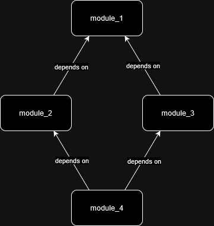

# gha-terraform-layers-example
Pipeline with example jobs simulating terraform plan and apply steps for a number of terraform entrypoints.

## Structure

There are 4 folders named as `module_x` each of which could be a seperate terraform root module (with associated state file, backend, etc.)

In this example imagine there is a dependency graph:

So the order of module deployment is:
- module_1
- module_2 & module_3 (in parallel)
- module_4
